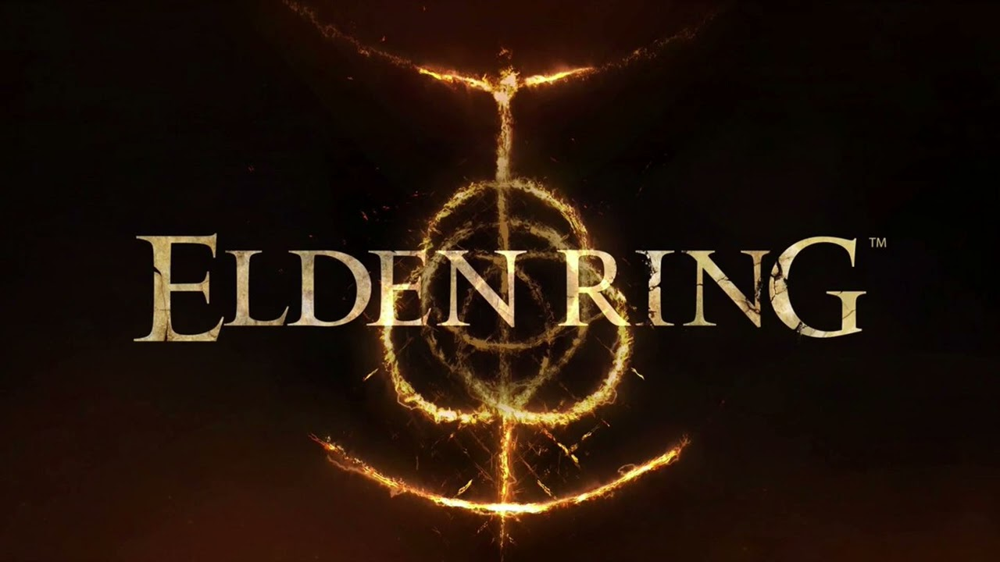

 🌑 Elden Ring — фанатский сайт



## 📖 Описание проекта
**Elden Ring Fan Site** — это некоммерческий фанатский проект, посвящённый одной из величайших игр в жанре action-RPG — Elden Ring от студии FromSoftware. Сайт создан для объединения информации о лоре, персонажах, оружии и загадках мира Междуземья в одном удобном и атмосферном интерфейсе.

На сайте представлены:

- последние новости и обновления игры;
- разделы с глубоким анализом лора и хроник;
- галерея легендарных персонажей и боссов;
- интерактивные карты регионов Междуземья;
- коллекция оружия, заклинаний и экипировки;
- адаптивный дизайн для всех устройств.

## 🎯 Цель проекта
Создать элегантную, атмосферную и информативную платформу, которая передаёт эпический дух Elden Ring и служит местом для изучения богатого мира, созданного Джорджем Мартином и Хидэтакой Миядзаки.

## 🧰 Стек технологий
| Технология | Назначение |
|------------|------------|
| HTML5 | Семантическая разметка |
| CSS3 | Стилизация и анимации |
| JavaScript | Интерактивность и логика |
| Google Fonts | Шрифты MedievalSharp и Cinzel |
| CSS Grid & Flexbox | Адаптивная верстка |
| Netlify | Хостинг и деплой |

## 🚀 Установка и запуск
```bash
# Клонировать репозиторий
git clone https://github.com/t4fs40/elden-ring-fan-site.git

# Перейти в директорию проекта
cd sait

# Установить зависимости
npm install

# Запустить локальный сервер
npm run dev

# Открыть в браузере
open index.html 
```

##  Или просто перейдите по ссылке: https://luminous-gumption-5eb508.netlify.app/

##🌐 Деплой
Проект развёрнут на Netlify с автоматическим деплоем из репозитория.

## Ссылка на сайт:
👉 https://luminous-gumption-5eb508.netlify.app/

## 🖼️ Структура сайта
Главная страница
https://images/landscape.jpg
Эпический заголовок с цитатой и призывом к путешествию
```
Раздел "Обновления"
https://images/Shadow%2520of%2520the%2520Erdtree.jpg
Последние патчи, DLC и события в мире Elden Ring

Раздел "Лор"
https://images/great-will.avif
Хроники Великой Воли, Войны Сокрушения и Владык Полукровки

Раздел "Персонажи"
https://images/melina.jpg
Легендарные персонажи: Мелина, Годрик, Радан и другие

Раздел "Оружие"
https://images/bloody-spear.png
Коллекция легендарного оружия, заклинаний и щитов

Раздел "Карты"
https://images/map-overworld.jpg
Интерактивные карты регионов Междуземья

Раздел "Галерея"
https://images/erdtree.jpg
Визуальная коллекция атмосферных скриншотов
```

##  ✨ Особенности
Атмосферный дизайн в стиле Elden Ring

```
Адаптивная верстка для всех устройств

Интерактивные элементы:

Модальные окна с детальной информацией

Табы для навигации по категориям оружия

Интерактивные маркеры на картах

Плавные анимации и переходы

Оптимизация производительности:

Lazy loading изображений

Эффективный CSS

Чистый JavaScript код
```

## 👨‍💻 Автор проекта
Разработчик: t4fs40
GitHub: https://github.com/t4fs40
Вдохновение: FromSoftware, Джордж Р. Р. Мартин, сообщество Elden Ring

## 🧾 Лицензия
Проект создан исключительно в образовательных и фанатских целях. Все права на материалы, изображения и контент Elden Ring принадлежат FromSoftware и Bandai Namco Entertainment.

"Что вершит судьбу человечества в этом мире? Некое незримое существо или закон, подобно Длани Господней парящей над миром?"


